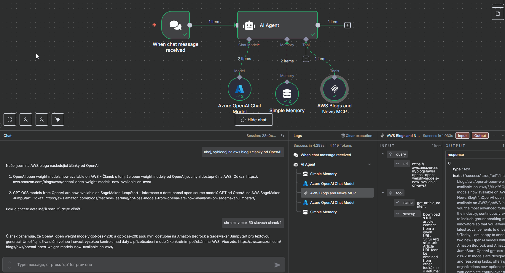

# AWS Blogs MCP Server

MCP server pro práci s AWS Blog a News články z [api.aws-news.com](https://api.aws-news.com/articles).

<div align="center">
  
[](https://www.buymeacoffee.com/mirecekdg)

</div>

## Popis

Tento MCP server poskytuje nástroje pro získávání a filtrování AWS blogových článků a novinek ze všech AWS kategorií. Server je postaven na frameworku FastMCP, je plně asynchronní (async/await) a podporuje SSE transport na portu 8807. Data jsou získávána z veřejného API a zpracovávána pomocí aiohttp a BeautifulSoup.

## Architektura

- **Entrypoint:** `main_sse.py` – nastavuje prostředí a spouští server.
- **Server:** `src/awsblogs_mcp_server/server_sse.py` – definuje všechny MCP nástroje, zpracovává argumenty a spouští FastMCP server.
- **Data Processor:** `src/awsblogs_mcp_server/data_processor.py` – zajišťuje komunikaci s API, filtrování, cachování a HTML parsing.
- **Cache:** In-memory cache (5 minut) pro seznamy článků (kromě vyhledávání, které vždy stahuje čerstvá data).
- **Validace:** Vstupní parametry jsou validovány na typ, přítomnost a (kde je relevantní) formát. Plné stažení obsahu je podporováno pouze pro AWS články (aws.amazon.com).

## Dostupné MCP nástroje

### 1. `get_todays_posts`
Získá články publikované dnes.

**Parametry:**
- `post_type`: "News", "Blog", nebo "Both" (výchozí)
- `limit`: Maximální počet článků (výchozí 20)

### 2. `get_posts_by_date`
Získá články z konkrétního datového rozsahu.

**Parametry:**
- `from_date`: Datum od ve formátu YYYY-MM-DD (volitelné)
- `to_date`: Datum do ve formátu YYYY-MM-DD (volitelné)
- `days_back`: Počet dní zpět od dneška (alternativa k from_date)
- `post_type`: "News", "Blog", nebo "Both" (výchozí)
- `limit`: Maximální počet článků (výchozí 50)

### 3. `get_posts_by_category`
Získá články z konkrétní kategorie.

**Parametry:**
- `category`: Název kategorie (např. "Big Data", "Machine Learning", "Industries")
- `post_type`: "News", "Blog", nebo "Both" (výchozí)
- `days_back`: Počet dní zpět od dneška (výchozí 30)
- `limit`: Maximální počet článků (výchozí 30)

### 4. `search_posts`
Vyhledá články podle textového dotazu pomocí API (hledá v názvu, URL a slug).

**Parametry:**
- `query`: Vyhledávací dotaz (hledá v názvu, URL a slug)
- `post_type`: "News", "Blog", nebo "Both" (výchozí)
- `days_back`: Počet dní zpět od dneška (výchozí 90)
- `limit`: Maximální počet článků (výchozí 25)

**Poznámka:** Vyhledávací dotazy vždy stahují čerstvá data a nevyužívají cache.

### 5. `get_categories`
Získá seznam všech dostupných kategorií článků.

### 6. `get_latest_posts`
Získá nejnovější články.

**Parametry:**
- `post_type`: "News", "Blog", nebo "Both" (výchozí)
- `limit`: Maximální počet článků (výchozí 20)
- `days_back`: Počet dní zpět od dneška (výchozí 7)

### 7. `get_popular_posts`
Získá populární články (označené jako popular=true).

**Parametry:**
- `post_type`: "News", "Blog", nebo "Both" (výchozí)
- `days_back`: Počet dní zpět od dneška (výchozí 30)
- `limit`: Maximální počet článků (výchozí 15)

### 8. `get_article_content`
Stáhne plný obsah článku z daného URL.

**Parametry:**
- `url`: URL článku (musí být z aws.amazon.com)

**Návratové hodnoty:**
- `title`: Titulek článku
- `content`: Plný text článku
- `description`: Meta popis
- `author`: Autor (pokud je dostupný)
- `published_date`: Datum publikace
- `content_length`: Délka obsahu v znacích
- `word_count`: Počet slov

**Poznámka:** Plné stažení obsahu je podporováno pouze pro AWS články (aws.amazon.com).

## Dostupné kategorie

Server podporuje filtrování podle těchto kategorií:
- Architecture
- AWS Cloud Operations
- AWS for Games
- AWS Insights
- AWS Marketplace
- AWS News
- AWS Partner Network
- AWS Smart Business
- Big Data
- Business Intelligence
- Business Productivity
- Cloud Enterprise Strategy
- Cloud Financial Management
- Compute
- Contact Center
- Containers
- Database
- Desktop & Application Streaming
- Developer Tools
- DevOps & Developer Productivity
- Front-End Web & Mobile
- HPC
- IBM and Red Hat
- Industries
- Integration & Automation
- Internet of Things
- Machine Learning
- Media
- Messaging & Targeting
- Microsoft Workloads on AWS
- Migration and Modernization
- .NET on AWS
- Networking & Content Delivery
- Open Source
- Public Sector
- Quantum Computing
- SAP
- Security
- Spatial Computing
- Startups
- Storage
- Supply Chain & Logistics
- Training & Certification

## Cache

- Seznamy článků jsou cachovány v paměti po dobu 5 minut (kromě vyhledávání).
- Vyhledávací dotazy vždy stahují čerstvá data z API.
- Cache se automaticky invaliduje po timeoutu nebo při změně parametrů.

## Instalace a spuštění

### Docker (doporučeno)

1. **Spuštění z GitHub Container Registry:**
   ```bash
   docker run -p 8807:8807 ghcr.io/mirecekd/awsblogs-mcp
   ```

2. **Build Docker image lokálně:**
   ```bash
   chmod +x build.sh
   ./build.sh
   ```

3. **Spuštění pomocí docker-compose:**
   ```bash
   docker-compose up awsblogs-mcp-sse
   ```

4. **Nebo lokální Docker build:**
   ```bash
   docker run -p 8807:8807 awsblogs-mcp-server:sse
   ```

### Lokální vývoj

1. **Instalace závislostí:**
   ```bash
   pip install -e .
   ```

2. **Spuštění serveru:**
   ```bash
   python main_sse.py --host 0.0.0.0 --port 8807
   ```

## Konfigurace MCP klienta

Pro použití v MCP klientu (např. Cline) přidejte do konfigurace:

```json
{
  "mcpServers": {
    "awsblogs": {
      "type": "sse",
      "url": "http://localhost:8807/sse/"
    }
  }
}
```

## API Endpoint

Server využívá veřejné API: `https://api.aws-news.com/articles`

## Funkce

- ✅ SSE transport na portu 8807
- ✅ Filtrování podle typu článku (News/Blog)
- ✅ Filtrování podle kategorie
- ✅ Datové filtrování (rozsah datumů, dny zpět)
- ✅ Textové vyhledávání (přes API)
- ✅ Cache mechanismus (5 minut, kromě vyhledávání)
- ✅ Strukturované odpovědi
- ✅ Docker podpora
- ✅ Asynchronní architektura (aiohttp, FastMCP)
- ✅ HTML parsing pomocí BeautifulSoup

## Struktura projektu

```
awsblogs-mcp/
├── src/awsblogs_mcp_server/
│   ├── __init__.py
│   ├── server_sse.py          # SSE MCP server (nástroje, serverová logika)
│   └── data_processor.py      # API klient, filtrování, cache, HTML parsing
├── main_sse.py               # SSE entry point
├── Dockerfile.sse            # Docker image pro SSE
├── docker-compose.yml        # Docker Compose konfigurace
├── build.sh                  # Build script
├── pyproject.toml            # Python projekt konfigurace
├── README.md                 # Anglická dokumentace
└── assets/
    ├── aws_blogs.png
    └── n8n-workflow.json
```

## Vývoj

Pro vývoj doporučujeme:

1. Fork repository
2. Vytvoření nové větve pro funkci
3. Testování lokálně pomocí `python main_sse.py`
4. Testování Docker buildu pomocí `./build.sh`
5. Vytvoření pull requestu

## Licence

MIT License - viz LICENSE soubor.

## Autor

Miroslav Dvořák (mirecekd@gmail.com)

## Příklady použití

### Integrace s N8N workflow

Tento MCP server lze snadno integrovat s N8N workflow pro automatizované zpracování AWS zpráv a notifikace.



Screenshot výše ukazuje reálný N8N workflow, kde je AWS Blogs MCP server použit jako nástroj v rámci AI Agenta. Workflow se skládá z:

1. **Chat Trigger** - Přijímá zprávy od uživatelů
2. **AI Agent** - Zpracovává požadavky pomocí Azure OpenAI
3. **AWS Blogs MCP Tool** - Získává AWS články na základě uživatelských dotazů
4. **Memory Buffer** - Udržuje kontext konverzace

**Příklad N8N Workflow:** Kompletní konfiguraci N8N workflow najdete v [./assets/n8n-workflow.json](./assets/n8n-workflow.json)

**Jak to funguje v praxi:**
- Uživatel se zeptá: "Ukaž mi nejnovější AWS články o Machine Learning"
- AI Agent využije MCP server k volání `search_posts` s dotazem "Machine Learning"
- Server vrátí relevantní AWS ML články s názvy, URL a shrnutími
- AI Agent formátuje odpověď pro uživatele s klikatelnými odkazy
- Kontext konverzace je udržován pro následné dotazy

Tato integrace umožňuje přirozené jazykové interakce s AWS obsahem, což usnadňuje sledování nejnovějších AWS novinek prostřednictvím konverzační AI.

## Inspirace

Projekt inspirován [aws-news-mcp-server](https://github.com/jritsema/aws-news-mcp-server) od jritsema.
